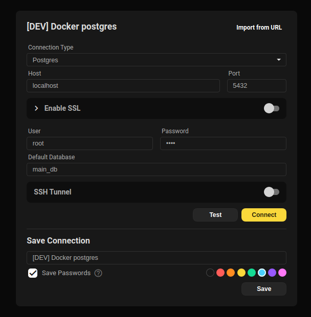

- [Beekeeper Studio](https://www.beekeeperstudio.io/)

We use Beekeeper Studio as our main database management tool (but you can use your own tool if you prefer).

## Connect to Local/DevStack database

- Connection: `Postgres`
- Host: `localhost`
- Port: `5432`
- User: `root`
- Password: `root`
- Default Database: `main_db`

